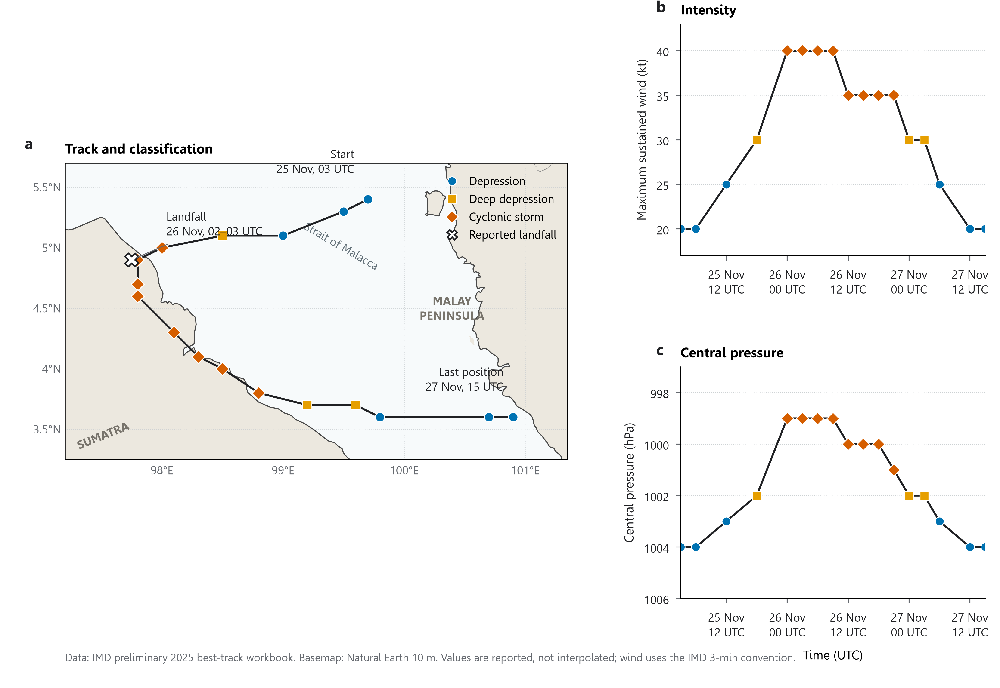

# Case 001 — Cyclone Senyar and the 2025 Sumatra Floods

## Status

**Preliminary reference chronology established**

This case is currently being developed. Scientific conclusions should not be inferred from the working hypotheses below.

---

## Event

In late November 2025, northern Sumatra experienced catastrophic rainfall, flooding, and landslides during an unusually active atmospheric period over the Maritime Continent.

During the event, Cyclonic Storm Senyar developed in the Strait of Malacca at an unusually low latitude and affected northern Sumatra and the surrounding region.

The broader atmospheric environment also included active tropical variability, monsoon circulation, and multiple tropical disturbances across the Indo-Pacific region.

This case investigates how those processes evolved and whether they interacted in ways that contributed to the development of Senyar and the extreme rainfall over Sumatra.

---

# Main research question

> **How did multiscale Indo-Pacific atmospheric and oceanic conditions combine during late November 2025, and which processes can be supported by evidence as important for the development of Cyclone Senyar and the extreme rainfall over northern Sumatra?**

The analysis will deliberately distinguish between:

- background environmental conditions
- tropical-wave and intraseasonal variability
- synoptic-scale circulation
- local rainfall-producing mechanisms
- hydrological and societal impacts

The existence of several simultaneous atmospheric features does **not** by itself establish that they interacted dynamically.

Interaction and causality will be evaluated only where the available evidence supports them.

---

# Scientific questions

## Q1 — Was the broader Indo-Pacific environment already favourable for enhanced convection?

Investigate the large-scale background state preceding Senyar.

Candidate factors include:

- Indian Ocean Dipole
- ENSO
- sea-surface temperature anomalies
- monsoon circulation
- large-scale moisture availability
- persistent precipitation anomalies

### Question

> Was the Maritime Continent embedded in an unusually favourable large-scale environment for convection and moisture transport before Senyar developed?

---

## Q2 — What role did tropical waves and intraseasonal variability play?

Investigate documented activity associated with:

- Madden-Julian Oscillation
- equatorial Rossby waves
- Kelvin waves
- other equatorial disturbances if supported by diagnostics

### Question

> Did tropical-wave or intraseasonal activity create an environment favourable for persistent convection or cyclonic vorticity near Sumatra?

---

## Q3 — Why could a tropical cyclone develop so close to the equator?

Senyar developed at an unusually low latitude in the Strait of Malacca.

The Coriolis parameter is

```math
f = 2\Omega\sin\phi
```

and becomes small close to the equator.

### Question

> What provided sufficient low-level rotation, convergence, moisture, and convective organisation for tropical cyclogenesis in this unusual location?

Potential mechanisms to investigate include:

- pre-existing relative vorticity
- ITCZ structure
- monsoon flow
- equatorial-wave circulation
- low-level convergence
- persistent deep convection
- upper-level divergence
- vertical wind shear
- sea-surface conditions

No individual mechanism will be assumed to be causal before analysis.

---

## Q4 — Was Indonesia influenced by multiple surrounding circulation systems?

A working hypothesis is that the Maritime Continent was surrounded by several simultaneously active disturbances and moisture pathways.

Potential systems include:

- Senyar near Sumatra
- Cyclone Ditwah toward the Bay of Bengal / Sri Lanka region
- Typhoon Koto over the South China Sea
- large-scale monsoon flow
- equatorial-wave disturbances

### Question

> Did these surrounding circulation systems measurably alter moisture transport, convergence, or regional circulation across Indonesia?

This hypothesis will be tested rather than assumed.

---

## Q5 — Why was rainfall over northern Sumatra so extreme?

Potential contributors include:

- Senyar circulation and rainbands
- persistent moisture convergence
- tropical-wave enhancement
- storm motion and persistence
- antecedent rainfall
- local topography
- possible orographic enhancement along the Barisan Mountains

### Question

> Which atmospheric processes are most strongly supported by observations and reanalysis as contributors to the magnitude and persistence of rainfall?

---

## Q6 — How predictable was Senyar?

Operational forecasts reportedly struggled with the location and evolution of cyclogenesis within a complex tropical environment.

### Question

> How successfully did available forecasts capture the genesis location, track, intensity, and precipitation associated with Senyar?

Where possible, archived forecasts will be used rather than retrospective analysis products.

---

# Spatial domains

Three nested domains will be used.

## Domain 1 — Indo-Pacific context

Approximate initial domain:

`70°E–160°E, 20°S–30°N`

Purpose:

- ENSO/IOD context
- monsoon circulation
- tropical disturbances
- large-scale moisture transport

## Domain 2 — Maritime Continent

Approximate initial domain:

`90°E–150°E, 15°S–20°N`

Purpose:

- regional circulation
- tropical waves
- moisture pathways
- surrounding weather systems

## Domain 3 — Sumatra and Strait of Malacca

Approximate initial domain:

`92°E–108°E, 8°S–10°N`

Purpose:

- Senyar cyclogenesis
- rainfall evolution
- moisture convergence
- topographic relationship
- local impacts

Domains may be adjusted if scientifically justified.

---

# Initial study period

The final analysis period has not yet been fixed.

The initial working period will cover approximately:

**1 November–5 December 2025**

This allows examination of:

- antecedent conditions
- tropical-wave evolution
- Senyar genesis
- extreme rainfall
- immediate post-event conditions

Longer climatological periods will be used where anomalies require an appropriate reference climatology.

---

# Evidence status before analysis

| Working statement | Current status |
|---|---|
| Senyar developed in the Strait of Malacca at unusually low latitude | Supported by authoritative operational sources |
| Senyar was an exceptionally rare cyclone for the Malacca Strait | Supported by WMO and IMD assessments |
| Northern Sumatra experienced extreme rainfall and severe impacts | Supported by BMKG, WMO and disaster-management sources |
| Negative IOD conditions were present | Supported by BMKG |
| Weak La Niña conditions were present | Supported by BMKG |
| Equatorial-wave activity affected the region | Supported by BMKG operational analysis |
| Multiple vorticity centres existed within the broader ITCZ environment | Supported by IMD operational assessment |
| Koto and Ditwah were active in the wider region | Supported by operational cyclone agencies |
| Koto directly contributed to Senyar's formation | **Not established** |
| Ditwah directly contributed to Senyar's formation | **Not established** |
| Surrounding systems dynamically "squeezed" Indonesia | **Not established** |
| Orography substantially amplified rainfall | **Hypothesis requiring analysis** |
| Negative IOD caused Senyar | **Not established** |
| Climate change caused Senyar | **Not established by this case** |

This table will be updated as evidence is evaluated.

---

# Planned data categories

No dataset is considered final until access, metadata, resolution, licensing, and scientific suitability have been verified.

Candidate categories include:

### Tropical cyclone information

- official Senyar track and intensity
- operational forecast tracks
- surrounding tropical systems

### Precipitation

- gauge observations where openly accessible
- GPM IMERG
- satellite-based rainfall estimates

### Atmospheric environment

Potential variables include:

- mean sea-level pressure
- 850-hPa winds
- 850-hPa relative vorticity
- 200-hPa winds/divergence
- geopotential height
- total-column water vapour
- vertically integrated moisture transport
- moisture-flux convergence
- vertical wind shear

### Ocean state

Potential variables include:

- sea-surface temperature
- SST anomalies
- relevant ocean-atmosphere climate indices

### Convection and tropical waves

Potential datasets include:

- outgoing longwave radiation
- equatorial wind anomalies
- established MJO and tropical-wave diagnostics

### Impacts

Potential sources include:

- BNPB
- BMKG
- AHA Centre
- official hydrological or infrastructure authorities
- satellite flood mapping

---

# Planned analysis sequence

The current intended order is:

1. verify event chronology
2. reconstruct Senyar track and intensity
3. establish large-scale Indo-Pacific background conditions
4. diagnose tropical-wave environment
5. examine synoptic circulation surrounding Indonesia
6. investigate Senyar cyclogenesis
7. reconstruct rainfall evolution
8. investigate moisture transport and possible topographic enhancement
9. assess impacts
10. assess forecast performance
11. evaluate which hypotheses are supported
12. document uncertainties and unresolved questions

This sequence may change if the evidence requires it.

---

# Reproducibility principle

The core analysis should rely as much as possible on openly accessible datasets.

Where data cannot legally or practically be redistributed, this case will provide retrieval instructions or scripts.

All published figures should identify:

- data source
- variable
- units
- valid period
- processing method where necessary

Derived quantities should be reproducible from the provided workflow.

---

# Publication rule

No mechanism will be presented as established merely because it appears physically plausible.

The final case will distinguish explicitly between:

**Observation**

**Derived result**

**Interpretation**

**Hypothesis**

**Unresolved question**

A scientifically defensible negative result is preferable to an unsupported positive conclusion.

---

# Current status

**Reference track established and visually checked.**

The preliminary IMD 2025 best-track workbook has been retained unchanged. Its 17 positional Senyar records have been extracted to a reproducible processed CSV with source-row provenance and documented quality-control checks.

The IMD operational sequence from the precursor circulation on 20 November to the remnant well-marked low on 27 November has been reviewed separately. Operational analyses and forecasts are not mixed into the preliminary reference track.

## Reference-track visual quality control



**Figure 1 | Preliminary IMD reference track and intensity of Cyclonic Storm Senyar.** **a,** Reported positions and classifications from 25 November 03:00 UTC to 27 November 15:00 UTC. The landfall marker is taken from the separate narrative row in the same workbook, which places landfall near `4.900°N, 97.750°E` between 02:00 and 03:00 UTC on 26 November. **b,** Maximum sustained wind under the IMD 3-minute averaging convention. **c,** Reported central pressure. Lines connect consecutive observations to make the sequence legible; they are not interpolated positions or intensity estimates. The figure preserves the preliminary reference track and does not add operational-advisory positions. Coastlines and national boundaries are from Natural Earth at 1:10-million scale.

The visual check confirms that the extracted sequence is geographically and temporally coherent: Senyar moved westward to the northern Sumatran coast, tracked south-eastward across northern Sumatra, and then moved eastward through the Strait of Malacca while weakening. This is a quality-control observation, not an attribution of motion or intensity change to a physical mechanism.

The figure is generated reproducibly with:

```powershell
.\.venv\Scripts\python.exe cases\001-senyar-sumatra\scripts\plot\plot_imd_senyar_track.py
```

The script uses Leelawadee throughout and exports editable vector versions (`PDF` and `SVG`) alongside a 600-dpi `PNG` preview.

Next step:

**Authenticate NASA Earthdata access, retrieve one IMERG Late V07 source granule and inspect its actual structure before defining regional subsetting.**
